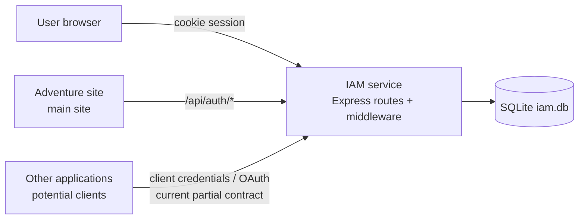
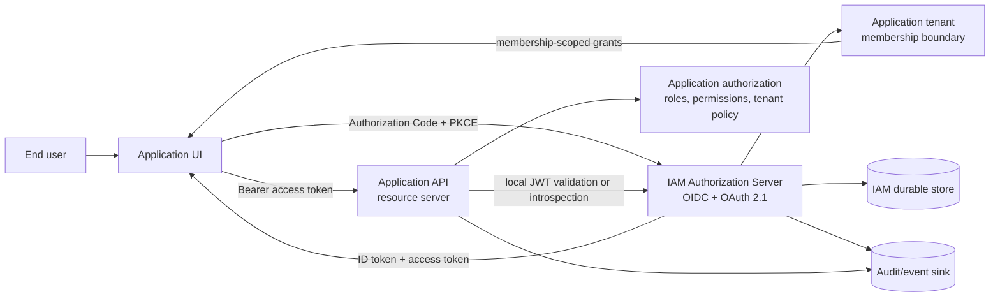
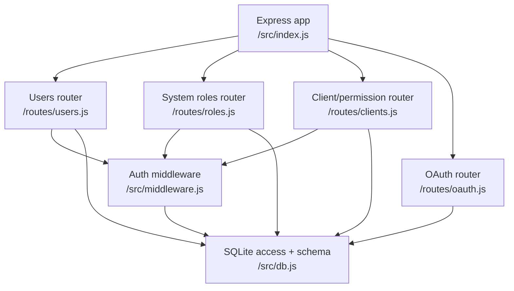
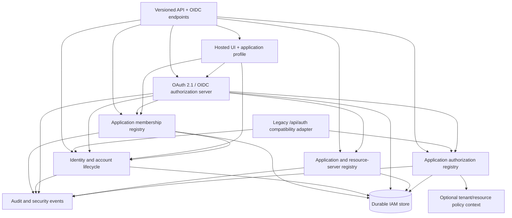
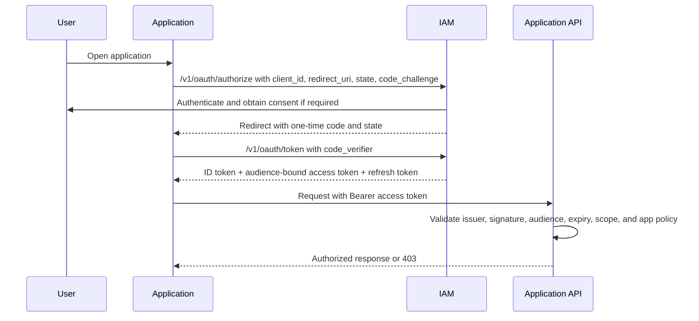
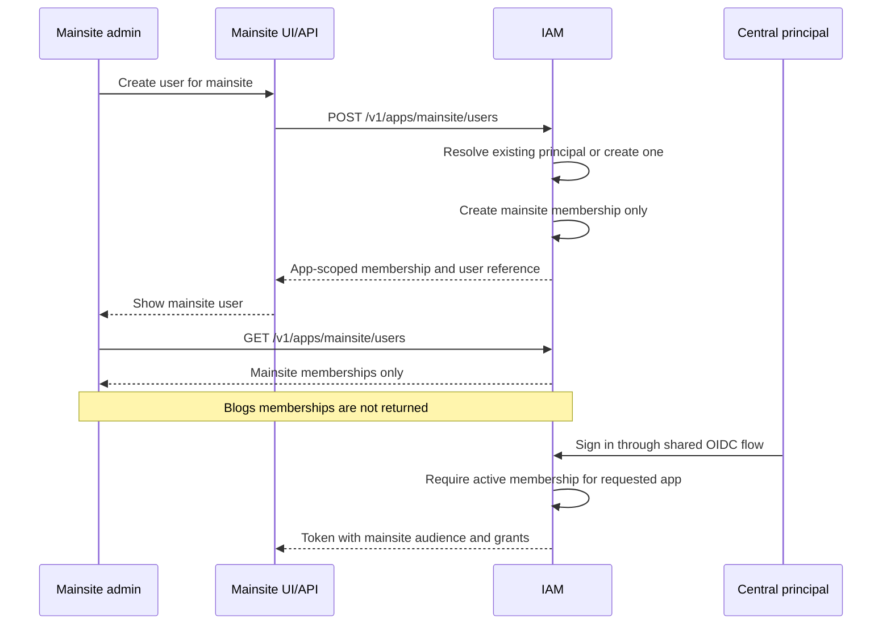
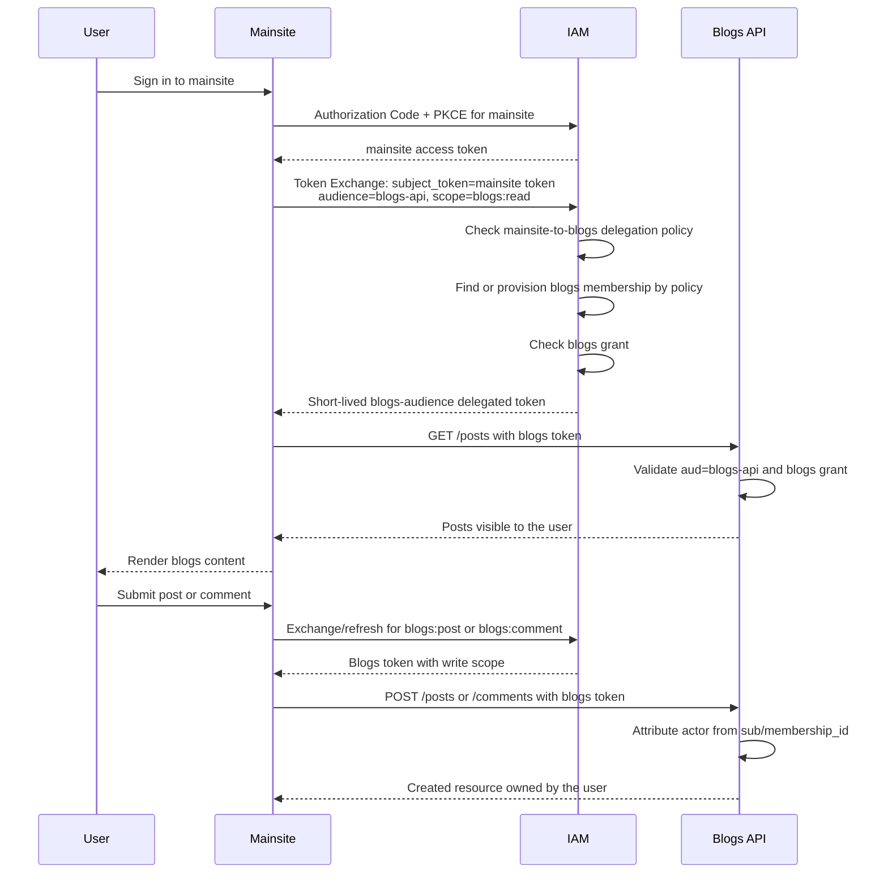
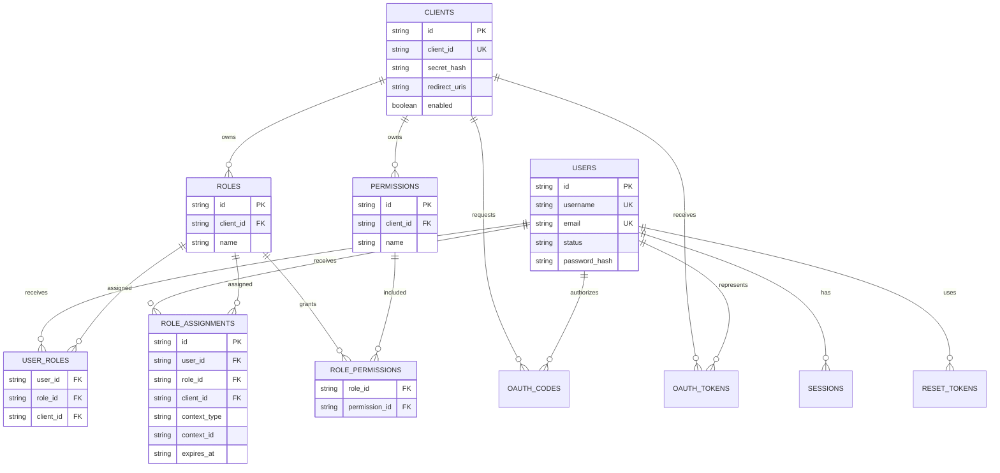
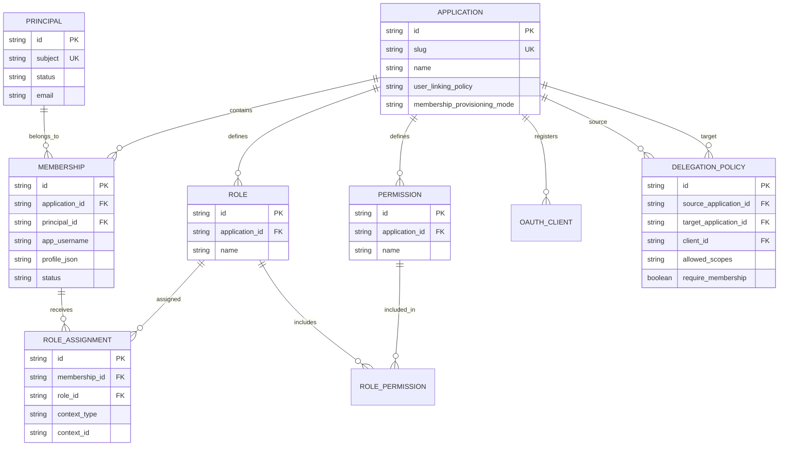

# IAM Platform Design and Integration Improvement Plan

## Table of Contents

- [1. Executive Summary](#1-executive-summary)
- [2. System Context and Integration Boundary](#2-system-context-and-integration-boundary)
  - [2.1 Current Context](#21-current-context)
  - [2.2 Target Context](#22-target-context)
- [3. Architecture Design](#3-architecture-design)
  - [3.1 Current Components](#31-current-components)
  - [3.2 Target Components](#32-target-components)
  - [3.3 Integration Workflows](#33-integration-workflows)
    - [Application user registration and membership](#application-user-registration-and-membership)
    - [Aggregated application access](#aggregated-application-access)
    - [Industry patterns applied to IAM](#industry-patterns-applied-to-iam)
- [4. Data Architecture](#4-data-architecture)
  - [4.1 Current Data Model](#41-current-data-model)
  - [4.2 Target Authorization Model](#42-target-authorization-model)
    - [Identity and membership semantics](#identity-and-membership-semantics)
- [5. Technology Stack and Standards](#5-technology-stack-and-standards)
- [6. Performance and Scalability](#6-performance-and-scalability)
- [7. Security Architecture](#7-security-architecture)
- [8. Error Handling and Resilience](#8-error-handling-and-resilience)
- [9. API Design and Versioning](#9-api-design-and-versioning)
- [10. Monitoring and Observability](#10-monitoring-and-observability)
- [11. Disaster Recovery and Business Continuity](#11-disaster-recovery-and-business-continuity)
- [12. Maintainability, Operability, and Delivery Plan](#12-maintainability-operability-and-delivery-plan)
- [13. Assumptions, Constraints, and Dependencies](#13-assumptions-constraints-and-dependencies)

## 1. Executive Summary

The IAM service currently combines three concerns:

1. A central user directory and password/session service.
2. OAuth-like authentication for registered application clients.
3. An authorization store whose roles are exposed as if they were global user properties.

The third concern is the integration problem. An application must adapt to IAM’s role vocabulary (`admin`, `member`, and any other globally visible role names), even though the application may define a role differently or need a different scope such as organization, project, team, resource, or subscription. That makes IAM an application-specific authorization system instead of a generic identity and access platform.

The target design is:

- IAM owns the centralized principal directory, authentication, sessions, consent, application membership, token issuance, and security lifecycle.
- Each registered application is an IAM tenant boundary. It can register or invite users into its own membership directory and define its own permissions, roles, policies, and optional tenant/resource context.
- A person may belong to multiple applications through separate memberships. Authentication is shared, but membership, profile data, roles, permissions, and administration remain application-scoped.
- An application administrator can see and manage only that application’s memberships. A user registered by `blogs` is not visible to a `mainsite` administrator unless a platform-level IAM operator explicitly has cross-application authority.
- IAM returns application-scoped claims and stable identifiers. It does not require every application to use IAM’s built-in role names.
- Applications validate tokens and enforce their own business authorization. IAM centrally stores identity and authorization grants, but it must not interpret an application’s role semantics as universal truth.
- IAM-hosted sign-in, registration, consent, and account-management UI is the default integration option. Each application can customize branding, fields, policy, and copy through a safe application profile or use its own UI against the same REST/OIDC APIs.
- OAuth 2.1 and OpenID Connect become the supported integration contract, with discovery, PKCE, signed tokens or secure introspection, audience validation, consent, revocation, and documented versioned APIs.

This document is an improvement backlog and target architecture. Statements about the current design are tied to the existing implementation; target behavior is explicitly marked as proposed.

### Implementation status

The first security and integration-hardening pass is implemented in the current working tree:

- Client registrations now carry a client type, enabled grant types, and allowed scopes.
- Authorization-code exchanges require S256 PKCE by default, validate exact redirect URIs and state, and persist nonce/code-verifier metadata.
- Authorization codes and OAuth tokens are rejected after expiry; refresh tokens rotate on use.
- OIDC discovery, JWKS, signed ID tokens, UserInfo, revocation, and standard HTTP Basic client authentication are available.
- Credentialed CORS is now opt-in through `IAM_ALLOWED_ORIGINS`; production bootstrap requires an explicit admin password.
- Cross-application role/permission reads and role-permission links are checked against the owning client.
- Consent is persisted per user/application and presented through a minimal allow/deny flow before the first delegated authorization.
- In-process rate limits, request IDs, Prometheus-style metrics, and durable audit events are wired into authentication, OAuth, and authorization administration paths.
- Role assignments now support `global`, `tenant`, `organization`, `project`, and `resource` contexts, and the same runtime is mounted under `/v1` during migration.
- Controlled OAuth 2.0 Token Exchange is now available for confidential/service clients. IAM requires an explicit source-client-to-target-audience delegation policy, intersects policy scopes with target permissions and the user’s target grants, and issues a short-lived audience-specific token without a refresh token.
- Exchanged tokens preserve the original user subject while recording the source client as `azp`/token client and the downstream API as `aud`; target resource servers may introspect exchanged tokens and UserInfo resolves target-app roles and permissions.
- Application-owned authorization manifests are now reconciled through `PUT /v1/clients/{clientId}/authorization-manifest`. Reconciliation is idempotent, preserves role IDs and assignments, updates role-permission links, and does not destructively remove omitted definitions.
- Known application clients can be bootstrapped from `applications.json` during IAM startup. IAM generates or validates their confidential secrets in the root `.vaults` file; administrators can also register clients interactively through the REST API or Applications UI, where a newly generated secret is returned once.
- The IAM UI now includes an administrator console for overview metrics, user lifecycle, application/OAuth client management, application scopes and roles, token-exchange delegation policies, and audit events. User-directory reads are restricted to system administrators.
- Blogs now owns a versioned authorization manifest and reconciles it with IAM during startup when configured with a confidential client and manifest endpoint.
- `iam/test/oauth.test.js` covers discovery, CORS rejection, PKCE exchange, consent, application-scoped claims, manifest reconciliation, and context isolation.

The remaining sections are still active work: application memberships and app-scoped user administration/provisioning, key rotation, stronger database constraints and migrations, external provisioning, migration of Adventure to versioned APIs, and production HA storage. The current runtime still has a global `users` table and legacy global user/role routes; the membership model below is the target that must be implemented before IAM is a generic multi-tenant platform.

### Centralized multi-tenant decision

The authoritative model is **central identity plus application membership**:

| Concept | Meaning |
|---|---|
| `principal` | The centralized IAM identity. It owns credentials and global lifecycle state. It does not carry application roles. |
| `application` | A registered IAM tenant such as `mainsite` or `blogs`. It owns membership, application profile, roles, permissions, and app administrators. |
| `membership` | The relationship between a principal and one application. It carries app-local username/profile/status and is the boundary used for visibility and authorization. |
| `role` / `permission` | Capabilities defined by one application. Identical names in different applications are unrelated. |
| `assignment` | A membership-to-role grant, optionally scoped to an organization, tenant, project, or resource inside that application. |

The same person may access multiple applications only when each application has an active membership for that person. Creating a user in one application never grants access to another application. An application can create a new principal plus its membership, or invite/link an existing principal according to the application’s user-linking policy; both operations remain inside the application boundary.

## 2. System Context and Integration Boundary

### 2.1 Current Context

The service is a Node.js/Express application backed by a local SQLite database. The IAM UI and the Adventure site use browser sessions and call IAM endpoints directly. Other applications can register as `clients` and use the OAuth routes, but the integration contract is incomplete and the authorization model remains coupled to IAM’s system roles.

The current application boundary is summarized below.



Current integration evidence:

- `iam/src/index.js` mounts user, role, client, and OAuth routers under `/api/auth` and serves an optional UI.
- `iam/src/db.js` stores users, clients, roles, permissions, assignments, sessions, authorization codes, and OAuth tokens in SQLite.
- `mainsite/app.js` now calls the compatibility-preserving `/v1/me`, `/v1/users`, and `/v1/roles` routes. The first-party site still uses the IAM console’s system-role administration model and remains a migration candidate for application-owned roles.
- `iam/src/middleware.js` authenticates either the IAM browser session or application client credentials for selected management routes.

### 2.2 Target Context

The target boundary separates centralized identity from application-tenant membership and authorization. A relying party integrates through OIDC for user sign-in, and a resource server validates access tokens for API calls. The application receives only the membership, roles, permissions, and context grants relevant to that application and requested audience.



The key contract is that `sub` identifies the user, `aud` identifies the intended API, and `scope`/application claims describe only grants for the requesting application. A role named `admin` in Application A has no implied meaning in Application B.

## 3. Architecture Design

### 3.1 Current Components

The current implementation has the following logical areas:

| Area | Current implementation | Integration consequence |
|---|---|---|
| Identity | `users` table, password hashing, browser sessions, password recovery | Central identity exists, but the same record currently also acts as the application-facing user record; there is no first-class membership boundary. |
| Application registry | `clients` table, shared-secret verification, redirect URI storage, client type, grants, allowed scopes, and delegation policies | Registration and cross-application audience policy exist, but the client registry is still a transitional local implementation rather than a production control plane. |
| Authorization | Client-scoped `roles`, `permissions`, `role_permissions`, and `user_roles`, plus application manifest reconciliation | Application namespaces and app-owned definition registration exist, but assignments point directly at global users and legacy `/roles` and `/users/:id/roles` APIs expose IAM system roles as the default model. |
| Application membership | No dedicated membership table or app-scoped user administration | An app administrator cannot be reliably limited to users registered for that app; cross-application visibility is too easy to introduce accidentally. |
| Token service | `/oauth/authorize`, `/oauth/token`, `/oauth/introspect`, `/oauth/userinfo` | It now supports controlled token exchange, but remains an opaque-token implementation with incomplete production OAuth/OIDC behavior and several validation gaps. |

The current component relationships are shown here.



### 3.2 Target Components

The target architecture should make the following boundaries explicit:

1. **Identity service**: user lifecycle, credentials, external identity links, account status, sessions, and recovery.
2. **OAuth/OIDC authorization server**: client registration, discovery, authorization code flow, PKCE, consent, token issuance, refresh rotation, revocation, userinfo, introspection, and controlled token exchange for delegated cross-application calls.
3. **Application membership registry**: application-owned memberships, app-local profiles, status, invitations, user-linking policy, and app administrator boundaries.
4. **Application authorization registry**: application-owned permissions, roles, role-permission relationships, service grants, and membership assignments. All records carry an application owner.
5. **Policy context**: optional tenant, organization, project, or resource context inside one application. IAM may issue a bounded grant or assignment; application policy remains in the application.
6. **Hosted UI and application profiles**: reusable sign-in, registration, consent, recovery, and account-management pages customized by branding, fields, locale, and policy.
7. **Administration API**: versioned APIs for IAM operators and application administrators with explicit scopes and audit events.
8. **Compatibility layer**: temporary support for the current `/api/auth/*` routes while applications migrate to `/v1/*` and OIDC discovery.



The hosted UI should be a reusable flow, not a forced application-specific product. IAM can render sign-in, registration, invitation acceptance, consent, recovery, and account-management screens using an application profile containing logo/colors, locale, copy, required registration fields, allowed registration mode, terms links, and redirect policy. Customization must be data-driven and allowlisted; applications must not inject arbitrary scripts or replace security-critical markup. Applications that need a completely different experience can own the UI and call the same versioned REST/OIDC APIs.

### 3.3 Integration Workflows

#### User sign-in: Authorization Code + PKCE



#### Service-to-service access

1. The application registers a confidential service client and explicitly enables `client_credentials`.
2. The client authenticates at the token endpoint using HTTP Basic or another documented confidential-client method.
3. IAM issues an access token only for scopes pre-authorized for that client and audience.
4. The resource server validates the token and applies service-level policy. A service token has no end-user `sub`.

#### Provisioning and authorization

The first user sign-in should support just-in-time application provisioning: create or link the application’s membership using the stable IAM subject. If centralized lifecycle provisioning is required, add SCIM or an event/webhook contract later. Do not make an application infer account identity from mutable username or email values.

#### Application user registration and membership

Application registration is distinct from user registration. Registering `mainsite` creates an IAM application tenant and one or more OAuth clients; it does not make every IAM principal a `mainsite` user. When `mainsite` registers a user, IAM creates or links a central principal and then creates a `mainsite` membership. The same principal can separately have a `blogs` membership.



The authorization rules are explicit:

- A shared principal is allowed; shared access is not automatic.
- An active membership is required for every application audience.
- Application administrators can list, create, update, suspend, and assign roles only for memberships owned by their application.
- An application administrator cannot discover another application’s memberships by changing an ID, client ID, query parameter, or token claim.
- A platform IAM operator may have cross-application support authority, but that authority must use a separate privileged scope and be audited.
- An app may choose self-registration, admin-created users, invitations, linking an existing principal, or any combination through its application policy.

Application membership provisioning is configurable per application. The target application may use:

- `pre_provisioned`: membership must already exist before access is granted;
- `auto_on_parent_membership`: creating a membership in a trusted parent application also creates a minimal target membership;
- `jit_on_first_access`: IAM creates a minimal target membership when an allowed delegated request first arrives;
- `explicit_opt_in`: the user must approve or complete target-application registration before access; or
- `invite_only`: only an invitation or administrator action can create the membership.

For the `mainsite` → `blogs` relationship, `jit_on_first_access` is the practical default if every mainsite user should be able to use blogs without a separate registration screen. This is a backend provisioning event, not a role translation or impersonation. It should still be disclosed through product terms/privacy messaging and audited. Apps that require explicit enrollment can select `explicit_opt_in` instead.

#### Aggregated application access

`mainsite` is an aggregator and portal for applications such as `blogs`. It should not use a generic mainsite service token for user-specific reads or writes, and it should not send a mainsite-audience user token to the blogs API. Both choices lose or misstate the end-user authorization context.

The recommended default is **user-delegated, audience-specific access**:

1. The user signs in to `mainsite` through IAM and receives a token for the mainsite audience.
2. `mainsite` requests a delegated token for the `blogs-api` audience using OAuth 2.0 Token Exchange / on-behalf-of semantics. The token request identifies the original user token, target audience, and narrowly requested blogs scopes such as `blogs:read`, `blogs:post`, or `blogs:comment`.
3. IAM verifies that the mainsite client is allowed to call blogs on behalf of users. If no blogs membership exists, IAM applies the blogs provisioning policy: it may create a minimal membership with a default blogs role, require user interaction, or deny the request.
4. IAM verifies the active blogs membership and required blogs-specific permission, then issues a short-lived blogs-audience token. Its `sub` identifies the user’s central principal, while its `app_id`, `membership_id`, `aud`, `scope`, and optional `roles` describe the blogs context—not the mainsite role context.
5. `mainsite` calls the blogs API with that token. Blogs validates the issuer, signature, audience, expiry, scopes, and blogs membership context, then attributes posts/comments to the `sub` or the blogs membership mapped to that subject.



The two alternatives have different meanings:

| Pattern | What blogs sees | Appropriate use | Problem for user-owned writes |
|---|---|---|---|
| `client_credentials` app-to-app token | `mainsite` service identity | Public content, background synchronization, caching, or explicitly system-owned operations | Blogs cannot safely know which user caused the request. A user ID header is not a trustworthy substitute for delegated authorization. |
| Mainsite token sent directly to blogs | Mainsite audience and mainsite grants | None unless blogs is intentionally the same resource server | Audience and permissions are wrong; blogs would need to trust another app’s claims and role vocabulary. |
| User-delegated blogs-audience token | User principal plus blogs membership and blogs grants | Recommended for reads, posts, comments, likes, and other user-owned actions | Requires token exchange/delegation policy and either existing or policy-authorized JIT membership provisioning. |
| Direct blogs authorization-code flow | User principal plus blogs membership and blogs grants | When the browser is actually using a blogs client/UI directly | Adds another client flow; still uses blogs-native roles and scopes. |

There is deliberately **no implicit mainsite-role-to-blogs-role mapping**. A mainsite role such as `premium_member` must not be interpreted as `blogs:author` by convention. Blogs owns its roles and permissions. If product policy requires an entitlement to cross the boundary, define an explicit, audited delegation or entitlement rule in IAM, for example `mainsite.premium_member -> blogs.blogs:read`; do not copy arbitrary role names into the blogs token.

The model supports automatic access either during mainsite registration or on first blogs access. Mainsite can ask IAM to create or link a blogs membership according to the blogs provisioning policy and assign a blogs default role, such as `reader`. If the user requests a write scope, blogs may provision a suitable default role such as `commenter`, subject to product policy. This is membership provisioning, not token impersonation. A user who is allowed to read blogs does not automatically receive `blogs:post` or `blogs:comment` unless the blogs policy explicitly grants it.

The delegated-token approach follows OAuth 2.0 Token Exchange semantics for a security token representing the party on whose behalf the request is made and lets the authorization server apply target-audience policy. See [RFC 8693](https://www.rfc-editor.org/rfc/rfc8693.html). Token exchange must still follow the current OAuth security best practices, including exact audience restriction, narrow scopes, short token lifetimes, client authentication, and replay protection; see [RFC 9700](https://www.rfc-editor.org/rfc/rfc9700.html).

#### Industry patterns applied to IAM

Popular identity and application suites generally separate four concerns rather than trying to solve them with one universal role or token:

| Industry pattern | How it works | Application to `mainsite` and `blogs` |
|---|---|---|
| Shared account / SSO | One central identity lets the user sign in to multiple products. SSO does not automatically mean the user has a product account or entitlement. | Keep one IAM principal, but let blogs decide whether to create a membership and which default access to grant. |
| JIT or automatic app provisioning | The target app account is created when an eligible user first accesses the app, or is provisioned from an assignment/group/license rule. Microsoft Entra documents automatic provisioning and on-demand provisioning; Auth0 documents automatic organization membership on login. | Configure blogs as `jit_on_first_access` if mainsite users should get a lightweight blogs account without a separate registration screen. Use SCIM/events or parent-membership provisioning for governed environments. |
| On-behalf-of API calls | A middle-tier API exchanges the incoming user token for a token targeted at the downstream API, preserving user context while changing the audience. Microsoft documents this pattern for web APIs calling downstream APIs. | Mainsite exchanges for a blogs-audience token. Blogs sees the real user and its own scopes, so posts/comments have a trustworthy owner. |
| Service-to-service calls | A service identity calls another service without an end user. | Use for public content, indexing, background jobs, and system-owned writes—not for user-owned posts/comments. |
| Target-application authorization | The downstream product owns its roles, permissions, resource rules, and ownership checks. | Blogs maps the IAM subject/membership to its own `reader`, `commenter`, or `author` policy. It does not import mainsite roles. |

The resulting IAM decision is a combination of these patterns: central principal, app-specific membership, configurable provisioning mode, and audience-specific delegated tokens. This matches the behavior documented by [Microsoft Entra automatic provisioning](https://learn.microsoft.com/en-us/entra/identity/app-provisioning/plan-auto-user-provisioning), [Auth0 JIT organization membership](https://auth0.com/docs/manage-users/organizations/configure-organizations/grant-just-in-time-membership), and [Microsoft’s on-behalf-of flow](https://learn.microsoft.com/en-us/entra/msidweb/call-downstream-apis/from-web-apis).

## 4. Data Architecture

### 4.1 Current Data Model

The current schema is more capable than the public API suggests: it already includes client-scoped roles and permissions. However, `users.roles` defaults to the IAM system client, the legacy routes encourage callers to treat those roles as universal, and there is no first-class application membership record separating a central principal from an app-local user.

The runtime now preserves the legacy `user_roles` table for compatibility but reads and writes `role_assignments`, which adds an explicit context type and context identifier. `oauth_consents` stores delegated-access decisions and `audit_events` records security and authorization administration events.



Important current-model constraints and risks:

- `roles.client_id` and `permissions.client_id` provide application namespaces, but the database does not enforce that every role-permission link belongs to the same client.
- `user_roles.client_id` duplicates the role’s client ownership and is not a composite foreign key. It can drift from `roles.client_id` unless all writes use the application route correctly.
- Role and permission identifiers are stable UUIDs internally, but assignment APIs use mutable names. Assignments and token claims should use stable IDs or namespaced keys.
- `toUserDto()` returns both `roles` for one selected client and an all-client `grants` map. This response shape is easy for an application to misinterpret as a global role set.
- The global `users` list and user-management routes do not yet provide an application ownership filter. They must be replaced or wrapped with membership-scoped APIs before application administrators are allowed to manage users through IAM.

### 4.2 Target Authorization Model

The minimum target model should retain the existing tables but make ownership and context first-class:

| Entity | Owner | Purpose |
|---|---|---|
| `principal` | IAM | Centralized identity, credentials, external identity links, and global lifecycle. The immutable subject is the integration key; it has no application roles. |
| `application` | IAM | Application tenant registration, redirect URIs, client type, enabled grants, allowed audiences, membership linking/provisioning policy, and application profile. |
| `membership` | Application | Principal-to-application relationship containing app-local username/profile, status, invitation metadata, and lifecycle. This is the application administrator’s visibility boundary. |
| `delegation_policy` | IAM + source/target applications | Explicit rule allowing one application client, such as `mainsite`, to request a user-delegated token for another application API, such as `blogs-api`, with an allowlisted scope set and membership requirements. |
| `resource_server` / `audience` | IAM or application owner | API that accepts tokens. Separating it from the OAuth client avoids confusing a browser app with an API. |
| `permission` | Application/resource server | Atomic capability such as `invoice:read`; never a global IAM permission. |
| `role` | Application/resource server | Application-defined bundle such as `billing_manager`; it has no cross-application meaning. |
| `role_permission` | Same application | Many-to-many role-to-permission mapping with same-owner enforcement. |
| `assignment` | Application | Membership-to-role grant, optionally scoped by tenant, organization, project, or resource, with effective dates. |
| `service_grant` | Application/resource server | Pre-authorized client-to-scope grant for machine-to-machine access. |
| `consent` | Principal + application/client | User approval and grant history for delegated access. |

### Identity and membership semantics

The target data model deliberately separates a global `principal` from an application-local `membership`:

1. A principal represents the person or service known to IAM. Credentials, account status, recovery, and external identity links are centralized.
2. A membership represents that principal’s account in one application. It may have an application-specific username, display name, profile fields, status, verification state, and invitation history.
3. Roles, permissions, assignments, and application administrator status attach to the membership or application, never directly to the principal.
4. The same principal can have different profiles and different roles in `mainsite` and `blogs`. The names `admin` or `member` are unrelated unless each application independently defines them.
5. An application admin API must derive the application scope from the authenticated client/operator and enforce it server-side. `application_id` supplied by a caller is a selector to validate, not an authority to trust.
6. The default integration mode is shared identity with explicit membership. An application may instead use an application-specific subject presentation, but it must still map access to an IAM principal internally.

The minimum relational shape is:



This model supports both requested behaviors: one user can use several applications through several memberships, while each application controls who is visible and what that user can do inside that application.

The target token contract should use claims similar to:

```json
{
  "iss": "https://iam.example.com",
  "sub": "immutable-user-or-service-subject",
  "aud": "application-api",
  "client_id": "registered-client",
  "app_id": "mainsite",
  "membership_id": "application-membership-id",
  "scope": "openid profile invoices:read",
  "roles": ["application-role-id-or-namespaced-name"],
  "tenant": "optional-tenant-id",
  "iat": 0,
  "exp": 0,
  "jti": "unique-token-id"
}
```

`roles` is optional and must be application-scoped. `app_id` and `membership_id` make the tenant boundary explicit when the token represents a human application session; service tokens may omit them. For large or highly dynamic authorization data, prefer `scope` plus an authorization lookup/introspection endpoint instead of putting every assignment into a token. The application must still check its own resource-level rules.

## 5. Technology Stack and Standards

### Current implementation

- Node.js ESM service using Express 4.22.3 and `cookie-parser` 1.4.7, declared in `iam/package.json` and resolved in `iam/package-lock.json`.
- Node’s built-in `node:sqlite` database driver with SQLite WAL mode and foreign keys enabled in `iam/src/db.js`.
- Passwords and client secrets are hashed with Node `crypto.scryptSync`; browser sessions and OAuth tokens are random opaque values stored in SQLite.
- `iam/openapi.yaml`, OIDC discovery/JWKS endpoints, request IDs, in-process rate limits, a small Prometheus-style metrics endpoint, durable audit events, and an automated Node test suite are now present. A production migration framework, external metrics exporter, and deployment manifest are still absent.

### Target standards and implementation decisions

1. Implement OAuth 2.1-compatible authorization code flow with PKCE (`S256`) for browser and public clients.
2. Implement OpenID Connect Core for user authentication: discovery, `openid` scope, ID token, nonce validation, UserInfo, and stable `sub`.
3. Publish `/.well-known/openid-configuration` and `/.well-known/jwks.json`.
4. Use signed JWT access tokens for high-volume resource-server validation or retain opaque tokens with a hardened introspection endpoint. The first version may support both, but every token must be audience-bound and expiry-checked.
5. Use the implemented OAuth 2.0 Token Exchange for controlled on-behalf-of calls from aggregators such as mainsite to resource servers such as blogs. Do not treat `client_credentials` as a user-delegation mechanism.
6. Publish an OpenAPI 3 contract for the versioned management and runtime APIs.
7. Keep the SQLite adapter behind a repository interface so PostgreSQL or another HA store can be introduced without changing OAuth/API behavior.

## 6. Performance and Scalability

The current single-process, SQLite-backed deployment is appropriate for development and a small installation, but no capacity or latency targets are defined. The following targets should become acceptance criteria for the generic integration contract; adjust them after load testing.

| Area | Proposed target |
|---|---|
| Discovery/JWKS | 95% under 100 ms and 99% under 250 ms for cached metadata. |
| Token endpoint | 95% under 300 ms and 99% under 750 ms for payloads up to 16 KB, excluding deliberate password-hash cost variance. |
| Introspection/UserInfo | 95% under 150 ms and 99% under 400 ms for payloads up to 32 KB. |
| Authorization lookup | 95% under 100 ms for a principal/membership/application/context lookup with up to 100 grants. |
| Initial capacity | At least 100 token requests/second and 1,000 concurrent authenticated sessions in a single-node deployment. |
| Availability | 99.9% monthly for a production multi-instance deployment, excluding scheduled maintenance. |
| Key rotation | New signing keys published at least 24 hours before use and old keys retained until all issued tokens expire plus a safety window. |

Required scalability work:

- Move sessions, authorization codes, refresh-token metadata, and revocation state to a shared durable store before running multiple IAM instances.
- Add indexes for client/audience lookups, assignment context, token identifiers, and expiry cleanup.
- Cache discovery and JWKS responses with bounded TTLs; do not cache authorization decisions longer than the policy freshness requirement.
- Replace startup-only cleanup functions with scheduled jobs or database TTL/retention mechanisms.

## 7. Security Architecture

### Current risks requiring remediation

The following are implementation-level gaps that should be addressed before advertising IAM as a general-purpose provider:

| Priority | Gap | Evidence | Required improvement | Status |
|---|---|---|---|---|
| P0 | OAuth authorization codes and tokens were read without an expiry check. | `iam/src/db.js`, `getAuthorizationCode()` and `getOauthToken()` | Reject expired codes/tokens at read time and delete or revoke them. | Implemented |
| P0 | User consent was absent from the authorization flow. PKCE, nonce, response-type, and redirect validation are now present. | `iam/src/routes/oauth.js` | Keep consent records auditable and add an explicit trusted-party policy only where product requirements justify bypassing consent. | Implemented |
| P0 | Client-credentials tokens accepted arbitrary requested scopes. | `iam/src/routes/oauth.js` | Store allowed grants per client and issue only the intersection of requested, registered, and audience-authorized scopes. | Implemented |
| P0 | Any valid application credential could reach client registration through the shared admin-or-client middleware. | `iam/src/routes/clients.js` | Restrict client registration to an IAM administrator and prevent public-client secret rotation. | Implemented |
| P0 | CORS reflected any supplied origin while allowing credentials. | `iam/src/index.js` | Use an explicit origin allowlist per environment; never combine credentialed CORS with arbitrary reflection. | Implemented |
| P0 | Development mode exposes reset tokens and the bootstrap password defaults to `admin123`. | `iam/src/routes/users.js`, `iam/src/db.js` | Keep these behaviors limited to an explicit local profile and require a strong production admin secret. | Partially implemented |
| P1 | UserInfo called undefined `getClientByIdCache`. | `iam/src/routes/oauth.js` | Fix the runtime path and add an end-to-end UserInfo test. | Implemented |
| P1 | Token endpoint required `client_secret` in the request body and did not fully implement standard client authentication. | `iam/src/routes/oauth.js` | Support HTTP Basic for confidential clients and PKCE/public-client rules without requiring a secret. | Implemented |
| P1 | Opaque tokens are stored in plaintext and there is no documented revocation/audit policy. | `iam/src/db.js` | Hash token handles where possible, add revocation, rotation, replay detection, and security audit events. | Remaining |
| P1 | Introspection permitted the token being introspected to authenticate the introspection request. | `iam/src/routes/oauth.js` | Restrict introspection to the resource server or an authorized confidential client. | Implemented |
| P1 | Role/permission ownership was enforced mainly in routes, not by the schema. | `iam/src/db.js` | Add same-application composite constraints and repository-level checks. | Partially implemented |
| P0 | There is no first-class application membership boundary. | Global `users` routes and direct user-to-role assignments | Add principal-to-application memberships and make every app user/admin/role API membership-scoped. | Remaining |

### Target controls

- Use separate client authentication policies for public, confidential, and service clients.
- Validate `iss`, signature, `aud`, `azp` where applicable, `exp`, `nbf`, `iat`, `jti`, token type, and required scopes.
- Use secure cookies with explicit domain/path policy, CSRF protection for state-changing browser endpoints, and a production-only `Secure` flag.
- Rate-limit login, password recovery, authorization, token, and introspection endpoints. Return generic recovery responses to prevent account enumeration.
- Add immutable audit records for login success/failure, client changes, secret rotation, consent, role/permission changes, token issuance, revocation, and administrative access.
- Do not place password hashes, client secrets, reset tokens, refresh tokens, or unnecessary personal data in application-facing payloads.
- Treat usernames and email addresses as mutable identifiers; use `sub` as the stable subject.
- Require an active membership for every human authorization request targeted at an application audience; authentication alone must never imply application access.
- Derive application-admin scope from the authenticated client/operator and enforce it on every membership, role, permission, and invitation query. Never trust an application ID supplied only in a request body or query string.
- Keep global principal search separate from application membership search. An application admin may search only its own memberships; platform operators need a separate privileged scope for cross-application search.
- Audit principal creation/linking, membership creation/suspension/deletion, invitation acceptance, app-admin changes, and any cross-application support access.
- Prevent confused-deputy behavior in aggregation: a source app may request only pre-approved target audiences/scopes, and the target app must authorize the delegated user rather than trusting the source app’s role names.
- For user-owned writes, derive the actor from the verified delegated token’s `sub`/target membership. Reject caller-supplied user IDs or headers as the sole ownership proof.

## 8. Error Handling and Resilience

The service currently returns simple JSON errors and logs uncaught errors to stderr. A generic provider needs a stable error contract that applications can safely handle.

### Required API behavior

- Use OAuth error names such as `invalid_request`, `invalid_client`, `invalid_grant`, `invalid_scope`, `unauthorized_client`, and `invalid_token` at protocol endpoints.
- Use a consistent problem response for management APIs: `type`, `title`, `status`, `code`, `detail`, `request_id`, and optional field errors.
- Never reveal whether a username, email, client, or token exists when the caller is unauthenticated unless the protocol requires it.
- Return `401` for missing/invalid authentication, `403` for valid authentication without authorization, `409` for version/ownership conflicts, and `429` for rate limiting.
- Make authorization-code consumption atomic so it cannot be replayed under concurrent requests.

### Resilience requirements

- Use transaction boundaries for role/permission updates, assignment replacement, client secret rotation, refresh-token rotation, and migrations.
- Add bounded timeouts and retry guidance to any external mail, directory, key-store, or event-sink integration.
- Keep old signing keys available during a rotation window and fail closed when a token has an unknown issuer or audience.
- Add health checks that distinguish process health, database readiness, and key/configuration readiness. `/health` currently reports only a static process-level `ok` response.
- Provide a maintenance mode for schema migration and a safe startup failure when security-critical configuration is missing.

## 9. API Design and Versioning

### Current API surface

The compatibility prefix is `/api/auth`; the same user, role, client, audit, and OAuth routes are now also mounted under `/v1`. The surface includes password/session endpoints (`/login`, `/logout`, `/me`, `/register`), IAM-system role routes (`/roles`, `/users/:id/roles`), client-scoped role and permission routes (`/clients/:clientId/roles`, `/clients/:clientId/permissions`), context-aware assignments, administrator-managed delegation policies (`/clients/:clientId/delegations`), audit events, and OAuth routes (`/oauth/authorize`, `/oauth/token`, `/oauth/introspect`, `/oauth/userinfo`).

The coexistence of legacy system-role routes and client-scoped routes is the main source of ambiguity. `/api/auth/me` returns a `roles` field by default for the built-in `sys_iam` client, while `/oauth/userinfo` currently labels application permissions as `roles`. Those fields need an explicit audience and namespace.

### Target API surface

Introduce `/v1` without breaking existing consumers:

| API | Purpose |
|---|---|
| `/.well-known/openid-configuration` | OIDC endpoint discovery. |
| `/.well-known/jwks.json` | Public signing keys. |
| `/v1/oauth/authorize` | Authorization Code + PKCE and consent. |
| `/v1/oauth/token` | Code, refresh-token, restricted client-credentials, and controlled token-exchange grants. |
| `/v1/oauth/revoke` | Access/refresh-token revocation. |
| `/v1/oauth/introspect` | Resource-server introspection. |
| `/v1/oidc/userinfo` | OIDC user claims. |
| `/v1/apps` | Registration and lifecycle of application tenants. `/v1/applications` may remain a compatibility alias. |
| `/v1/apps/{appId}/clients` | OAuth client registration and lifecycle for one application tenant. |
| `/v1/clients/{clientId}/delegations` | Current implementation: explicit allowlist for which source client may request target-audience tokens and scopes. The target application-tenant API will later expose this as `/v1/apps/{appId}/delegation-policies`. |
| `/v1/apps/{appId}/users` | Create, invite, list, update, suspend, and link memberships for one application only. |
| `/v1/apps/{appId}/users/{userId}` | Read or update one app-scoped membership; never a global user lookup. |
| `/v1/apps/{appId}/roles` | Application-owned roles. |
| `/v1/apps/{appId}/permissions` | Application-owned permissions. |
| `/v1/apps/{appId}/assignments` | Membership-to-role grants with optional tenant, organization, project, or resource context. |
| `/v1/apps/{appId}/me` | Current principal’s membership, profile, and effective app-scoped grants. |
| `/v1/apps/{appId}/ui-profile` | Branding, registration fields, locale, copy, and safe hosted-UI customization. |
| `/v1/admin/principals/{id}` | Platform-level identity lifecycle; not an application authorization endpoint. |

API rules:

1. Use immutable IDs in URLs and assignments; names are labels and compatibility aliases.
2. Bind every app-scoped request to the application represented by the authenticated client or operator scope. If `{appId}` does not match that bound application, return `403`.
3. Before issuing a human token for an application audience, resolve an active target membership either from existing data or from an explicitly allowlisted provisioning policy. A valid IAM session alone is not sufficient.
4. Return `roles`, `permissions`, and `scope` only with a documented application namespace. Do not return a bare global `roles` array from a generic user endpoint.
5. Document required client authentication, scopes, errors, idempotency, pagination, and ETags in OpenAPI.
6. Keep platform-wide principal administration separate from app-scoped membership administration, with different scopes and audit events.
7. Permit token exchange only through an explicit source-client/target-audience delegation policy, with allowlisted scopes and a target membership that already exists or is created by the target application’s approved provisioning mode.
8. Preserve the original user as the delegated subject and record both source client and target audience in audit events. A service token must not be allowed to claim an end user through an untrusted header.
9. Deprecate legacy system-role endpoints after the Adventure site migrates to application-scoped administration.

## 10. Monitoring and Observability

The service now has request IDs, audit-event persistence, basic counters, and a static `/health` endpoint. It still needs production-grade structured log shipping, distributed metrics, tracing, and security alerting. Add:

- Structured JSON logs with timestamp, level, request ID, route, client ID, subject ID when safe, status, latency, and error code. Never log secrets, passwords, authorization codes, or bearer tokens.
- Metrics for login failures, token issuance, token exchange failures, refresh reuse, introspection latency, authorization denials, rate-limit events, active sessions, database latency, and cleanup backlog.
- Traces across authorize, token, UserInfo, introspection, and application callbacks using a propagated request/trace ID.
- Security alerts for repeated failed logins, abnormal token failures, refresh-token reuse, client-secret rotation, privilege changes, and disabled-client use.
- Operational dashboards with availability, p95/p99 latency, error rate, database size, WAL growth, and key rotation status.

Minimum service-level indicators:

```text
availability = successful health/readiness checks / total checks
token_success_rate = successful token responses / token requests excluding client 4xx policy errors
authorization_denial_rate = 403 responses / authenticated application requests
credential_failure_rate = failed login and client-auth attempts / total attempts
```

## 11. Disaster Recovery and Business Continuity

SQLite WAL is useful for local durability, but the current repository has no backup, restore, replication, or migration procedure. A production IAM service must protect identity and authorization state as critical data.

### Required baseline

- Define an RPO of at most 15 minutes and an RTO of at most 60 minutes for the initial production deployment.
- Back up the database, schema version, signing keys, client registry, and configuration secrets using separate protected storage.
- Test restore at least quarterly, including verification that principals, memberships, assignments, tokens, client secrets, application profiles, and signing-key metadata are internally consistent.
- Keep signing-key backups separate from database backups and document key compromise recovery.
- Use a migration table and forward-only migrations; do not rely on implicit startup schema mutation for production upgrades.

### Scale-out decision

Before multiple IAM instances are deployed, move shared mutable state from local SQLite to a supported HA database. If SQLite remains the supported mode, explicitly limit it to single-instance deployments and document file-locking, WAL, backup, and filesystem requirements.

## 12. Maintainability, Operability, and Delivery Plan

### Recommended delivery order

| Phase | Priority | Deliverables | Exit criteria |
|---|---:|---|---|
| 0. Secure current flow | P0 | Expiry checks, CORS allowlist, safe bootstrap, PKCE, standard client auth, scope allowlists, UserInfo fix, token/code tests. | Negative protocol tests pass; no expired/replayed token is accepted. |
| 1. Central identity plus application memberships | P0 | Add `applications`, `memberships`, app-scoped user registration/invitation APIs, membership-based assignments, provisioning modes, app-admin scopes, and migration of global users into principals plus memberships. | `mainsite` and `blogs` can share one principal while each admin sees only its own memberships; blogs can provision an eligible membership on first access without importing mainsite roles. |
| 2. Publish integration contract | P1 | `/v1`, discovery, JWKS, OIDC claims, OpenAPI, SDK/example integration, audience-specific tokens, controlled token exchange, and compatibility deprecation policy. | A new application can integrate using documentation only, and an aggregator can call another app on behalf of a user without role translation. |
| 3. Production operation | P1 | Structured audit, metrics, rate limits, revocation, scheduled cleanup, backup/restore, migration framework. | Restore and security-incident runbooks pass review. |
| 4. Advanced lifecycle and hosted experience | P2 | JIT provisioning, SCIM/events, tenant/resource context, delegated administration, external identity providers, application UI profiles, and safe hosted-UI customization. | Requirements are validated by at least two applications with different tenancy and registration models. |

### Definition of done for generic application integration

- An application can register as public, confidential, or service client.
- An application can create or link users without exposing users from another application.
- It can choose its own role and permission names without modifying IAM system roles.
- A user can have different profiles, memberships, roles, and tenant contexts in different applications.
- An application receives a stable `sub`, a correct `aud`, an explicit application/membership context, bounded scopes, and only its own authorization context.
- An aggregator such as mainsite can request a narrowly scoped token for blogs on behalf of a user; blogs attributes user-owned writes to that user without importing mainsite roles.
- An application administrator cannot read or mutate another application’s memberships, roles, permissions, or UI profile.
- The application can validate tokens without sharing the IAM database.
- Token expiry, revocation, replay, redirect URI, PKCE, state, nonce, and audience behavior are covered by automated tests.
- API and token errors are documented and stable across patch releases.
- Operators can audit and revoke access, rotate secrets/keys, restore the service, and identify failures from metrics and logs.

## 13. Assumptions, Constraints, and Dependencies

### Assumptions

- IAM remains the centralized source of truth for authentication, principals, application memberships, and application role/permission mappings.
- Each application is an IAM tenant for membership and administration purposes. An application may manage its own users through IAM APIs, but it cannot manage another application’s memberships.
- A person may use several applications through separate memberships. A principal created for one app is not automatically provisioned into any other app.
- Applications remain responsible for business authorization and resource-level decisions after IAM establishes the application-scoped identity and grants.
- Some applications will need tenant, organization, project, or resource context; this must be modeled explicitly rather than encoded in a global role name.
- The Adventure site is an existing consumer and requires a compatibility migration rather than an immediate breaking change.

### Constraints

- The current service uses Node.js ESM, Express, and SQLite; the first implementation should preserve that local development path.
- Existing `/api/auth/*` routes and browser UI are already coupled to system roles and should be deprecated gradually.
- Password recovery and account administration may require an email provider or external identity provider, neither of which is currently configured.
- A signed-token design requires secure key storage and rotation; an opaque-token design requires high-availability introspection and revocation storage.

### Dependencies and decisions still required

1. Select JWT, opaque tokens, or both for the first production integration contract.
2. Define principal deduplication and account-linking rules: when an app registration matches an existing email/external identity, when linking requires proof or invitation, and whether email is globally unique.
3. Define application membership lifecycle and uniqueness: app-local username rules, invitation expiry, suspension/deletion semantics, self-registration policy, and whether a principal can hold multiple memberships in one app.
4. Define the tenant/resource context model and whether assignments are valid for one application, one tenant, or one resource.
5. Define the cross-application delegation policy: which source clients may request which target audiences, whether user consent is required, how blogs memberships are auto-provisioned, and which scopes are allowed for mainsite aggregation.
6. Choose a production database and secret/key-management system.
7. Confirm the external email, audit, metrics, and identity-provider integrations.
8. Define the hosted-UI customization contract and its security allowlist; decide which registration fields and policy settings applications can control.
9. Agree on the deprecation timeline for `sys_iam` role APIs and the current `/api/auth` prefix.

The architectural decision to preserve is the separation of concerns: a role is meaningful only within the application and context that owns it; the IAM platform must provide the identity and protocol guarantees that let every application express its own authorization model safely.
